# Agent_Portal

## 專案架構圖
```
agent_portal/
│ 
├── config.py
├── utils/
│   ├── log_utils.py
│   ├── ocr_utils.py
│   ├── embedding_utils.py
│   └── get_file_utils.py
│ 
│   # ocr -> chunking -> embedding -> qdrant
├── indexer/
│   ├── chunking.py
│   └── indexer_pipeline.py
│
│   # summary -> embedding -> qdrant
├── summary/
│   ├── summary.py
│   └── summary_pipeline.py
│
│   # vector search
├── retriever/
│   ├── requirements.txt
│   ├── search.py
│   ├── rerank.py
│   ├── retrieve_pipeline.py
│   └── api.py
│ 
│   # agent flow
├── agent/
│   ├── requirements.txt
│   ├── search_tools.py
│   ├── mrkl.py  
│   ├── agent_pipeline.py 
│   └── api.py
│ 
│   # streamlit UI介面
├── frontend/
│   ├── config.py
│   ├── requirements.txt
│   ├── kw_mapping.json
│   ├── intent.py
│   └── app.py 
│
│   # qdrant db
├── db/
│   └── collection/
│       ├── chunk_product-overview
│       ├── summary_product-overview
│       ├── chunk_other
│       └── summary_other
│
│   # embedding model: BGE-M3
├── model/
│
├── pdf_files/
│   ├── product-overview/
│   │   ├── <pdf_1>
│   │   ├── <pdf_2>
│   │   │
│   │   ├── json_files/
│   │   │   ├── <json_1>
│   │   │   └── <json_2>
│   │   │
│   │   ├── chunk_json_files/
│   │   │   ├── <chunk_json_1>
│   │   │   └── <chunk_json_2>
│   │   │
│   │   ├── summary_json_files/
│   │   │   ├── <summary_json_1>
│   │   │   └── <summary_json_2>
│   │   │
│   │   └── logs/
│   │       ├── ocr_logs/      
│   │       │   └── indexer_ocr.log 
│   │       ├── chunk_logs/
│   │       │   └── indexer_chunk.log  
│   │       ├── summary_logs/
│   │       │   └── summary.log 
│   │       └── embed_logs/
│   │           ├── indexer_embed.log   
│   │           └── summary_embed.log  
│   │ 
│   ├── application-and-medical/    
│   ├── customer-policy-service/  
│   └── other/ 
│ 
│   # YAMLs for EKS
└── eks/
    ├── qdrant-service.yaml
    ├── indexer-job.yaml
    ├── summary-job.yaml
    ├── retriever-deployment.yaml
    ├── agent-deployment.yaml
    ├── frontend-deployment.yaml
    ├── frontend-service.yaml
    ├── s3-pvc.yaml
    ├── s3-sc.yaml
    ├── ebs-pvc.yaml
    ├── ebs-sc.yaml
    ├── trust-policy.json
    └── iam-policy.json
```


## utils

```
├── config.py
├── utils/
│   ├── log_utils.py
│   ├── ocr_utils.py
│   ├── embedding_utils.py
│   └── get_file_utils.py
```

---

### `log_utils.py`

> 處理 log 相關的函式

- `create_time_log_entry()`
- `log_to_file()`
- `get_processed_files()`

---

#### `create_time_log_entry(filename: str, description: str, start_time: float) -> str`

- 目的：輸入檔案名稱、描述、處理開始時間，以建立日誌條目

#### `log_to_file(log_entry: str, log_file_path: str) -> None`

- 目的：將日誌條目添加到指定的日誌檔案中
- 主要邏輯：
    - 讀取 log 檔並刪除
    - 將就內容與新增內容合併
    - 開啟新檔案將內容寫入

#### `get_processed_files(log_file_path: str) -> Set[str]`

- 目的：讀取 log 檔案，獲取已處理過的檔案列表

---

### `ocr_utils.py`

> 將 PDF 檔案經過 OCR 後存成 JSON 檔

- `merge_tables_by_position()`
- `extract_tables_and_text()`
- `convert_pdf_to_json()`

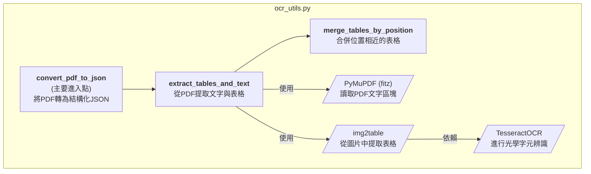

---

#### `merge_tables_by_position(tables_dict:  Dict[int, List[ExtractedTable]]) -> Dict[int, List[ExtractedTable]]`

- 目的：將同一頁面中「位置相鄰、應視為同一張表格」的表格物件合併
- 主要邏輯：
    - 逐頁處理表格清單
    - 逐一檢查相鄰表格是否應合併
        - 縱向距離小（<100 px）
        - 欄位數差異小（<=1）
        - 左邊界 x1 相近（<100 px）
    - 表格合併
        - 合併兩個表格的 content（依原順序重新索引）
        - BBox 重新包住上下兩段，成為一個完整表格
        - Title 合併：兩者都有就串起來；其中一者有就沿用
    - 跳過已合併的表格繼續處理下一個組
    - 輸出表格

#### `extract_tables_and_text(pdf_path: str) -> Tuple[Dict[int, List[str]], Dict[int, List[pd.DataFrame]]]`

- 目的：OCR 主要處理流程：從 PDF 中提取表格和文字
- 主要邏輯：
    - 初始化 OCR 與 PDF
    - 提取表格並處理（調用 `merge_tables_by_position()`）
    - 逐頁處理 PDF
    - 定位每個表格的 BBox
    - 擷取頁面文字並排除表格區塊
    - 輸出整理後的內容
        - 純文字 texts_per_page（不含表格內文字）
        - 表格 DataFrame tables_per_page

#### `convert_pdf_to_json(pdf_path: str, json_path: str, with_tables: bool = True) -> bool`

- 目的：將 PDF 用 OCR 處理存 JSON 檔
- 主要邏輯：
    - PDF 文字與表格提取（調用 `extract_tables_and_text()`）
    - 逐頁整理內容
    - 生成 JSON 結構
        ```
        [
            {
                "filename":"團險全體受益人聲明書暨受益系統表-1120101.pdf",
                "page": 1,
                "content":"聲明書 一、立書人全體因南山人壽保險股份..."
            },
            {
                "filename":"團險全體受益人聲明書暨受益系統表-1120101.pdf",
                "page": 2,
                "content":"壽險業履行個人資料保護法告知義務內容..."
            },
            ...
        ]
        ```

---

### `embedding_utils.py`

> 進行向量化和上傳至資料庫，分為 chunk, summary 兩種

嵌入處理類別 `class EmbeddingProcessor`
- `__init__()`
- `_generate_point_id()`
- `_embed_text()`
- `_upsert_points()`
- `chunk_embedding_upsert()`
- `summary_embedding_upsert()`

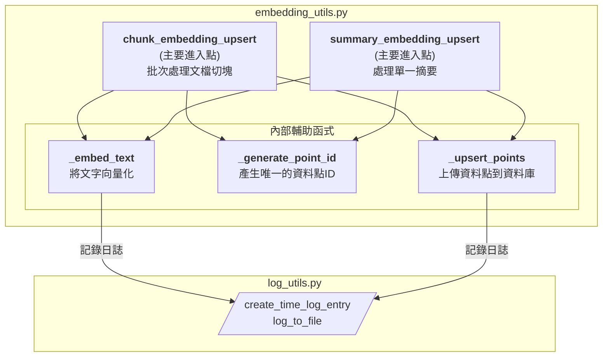


---

#### `__init__(self, embedding_model, client)`

- 目的：輸入實例化模型跟向量資料庫客戶端

#### `_generate_point_id(self, filename: str, page: int, index: int, search_type: str) -> str`

- 目的：透過輸入的參數資訊生成唯一的點 ID

#### `_embed_text(self, texts: List[str], filename: str, desc: str, log_file_path: str) -> List[List[float]]`

- 目的：對文本列表進行向量化，並記錄日誌

#### `_upsert_points(self, collection: str, points: List[PointStruct], filename: str, desc: str, log_file_path: str) -> None`

- 目的：將點列表上傳到 Qdrant，並記錄日誌

#### `chunk_embedding_upsert(self, chunks: List[Dict], filename: str, collection: str, log_file_path: str, batch_size: int=config.chunk_batch_size) -> bool`

- 目的：對切塊文本進行向量化並上傳到 Qdrant
- 主要邏輯：
    - 讀取輸入的 chunks: List[Dict]
    - 分成小批次
    - 進行向量化
    - 建立資料點
    - 上傳資料庫

#### `summary_embedding_upsert(self, summary_data: Dict, collection: str, log_file_path: str) -> bool`

- 目的： 讀取單一摘要 JSON，向量化後上傳到 Qdrant
- 主要邏輯：
    - 讀取輸入的 summary_data: Dict
    - 分成小批次
    - 進行向量化
    - 建立資料點
    - 上傳資料庫

---

### `get_file_utils.py`

> - 取得資料夾路徑
> - 多資料夾處理函式

- `get_folder_paths()`
- `get_pdf_folders()`
- `process_all_folders()`

---

#### `get_folder_paths(folder_name: str) -> dict`

- 目的：根據資料夾名稱，返回相關的路徑字典
- 主要邏輯：
    - PDF 子資料夾路徑
    - ocr 後的 json 檔案路徑
    - chunking 後的 json 檔案路徑
    - summary 後的 json 檔案路徑
    - indexer ocr log 檔案路徑
    - indexer chunking log檔案路徑
    - summary log 檔案路徑
    - indexer embedding log 檔案路徑
    - summary embedding log 檔案路徑
    - 子資料夾對應的 chunk collection name
    - 子資料夾對應的 summary collection name

#### `get_pdf_folders(folder_path: str) -> list`

- 目的：獲取 PDF 基礎目錄下的所有資料夾

#### `process_all_folders(processing_method: callable) -> None`

- 目的：使用指定的處理方法處理 PDF 基礎目錄下的所有資料夾（調用`get_pdf_folders()`）

---

## indexer

```
├── indexer/
│   ├── chunking.py
│   └── indexer_pipeline.py
```
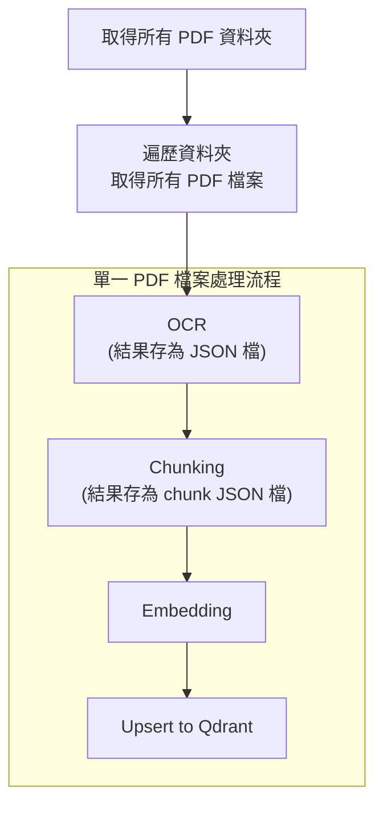

---

### `chunking.py`

> 將 OCR 後的原始 JSON 檔案內容進行切塊，再存為 chunk JSON 檔


- `create_chunks()`
- `process_json_to_chunks()`

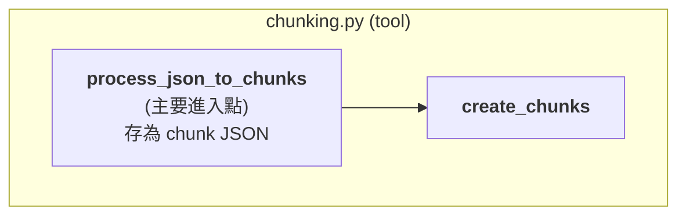

---

#### `create_chunks(text: str, chunk_size: int = 1000) -> List[str]`

- 目的：將文本分塊
- 主要邏輯：
    - 依段落初步分塊：
        - 將文本以 \n 分段
        - 將段落累積到 current_chunk，直到長度接近 chunk_size → 形成初步 chunk
    - 若初步 chunk 長度仍超過 chunk_size：
        - 依句號「。」切分成小句
        - 逐句累積成新 chunk，確保每個 chunk 不超過 chunk_size

#### `process_json_to_chunks(input_json_path: str, output_json_path: str, metadata: List[str] = None) -> bool`

- 目的：將 JSON 檔內容切 chunk，另存新的 chunk JSON 檔
- 主要邏輯：
    - 讀取輸入的 JSON 檔案
    - 逐頁處理內容
    - 切分成 chunk（調用 `create_chunks()`）
    - 生成 JSON 結構
        ```
        {
            "chunk_1": {
                "filename": "長照保險商品條款.txt",
                "page": 1,
                "content": "南山人壽增心陪伴長期照顧保險(一次給付)_PILTC 南山人壽保險股份有限公司..."
            },
            "chunk_2": {
                "filename": "長照保險商品條款.txt",
                "page": 2,
                "content": "南山人壽增心陪伴長期照顧保險(一次給付)_PILTC 係指依第十二條約定..."
            },
            "chunk_3":{
            ...
            }
        }
        ```

---

### `indexer_pipeline.py`

>  處理 Indexer 整體流程

- `Indexer` 流程類別
    - `__init__()`
    - `process_folder()`
- 主程式入口`main()` 

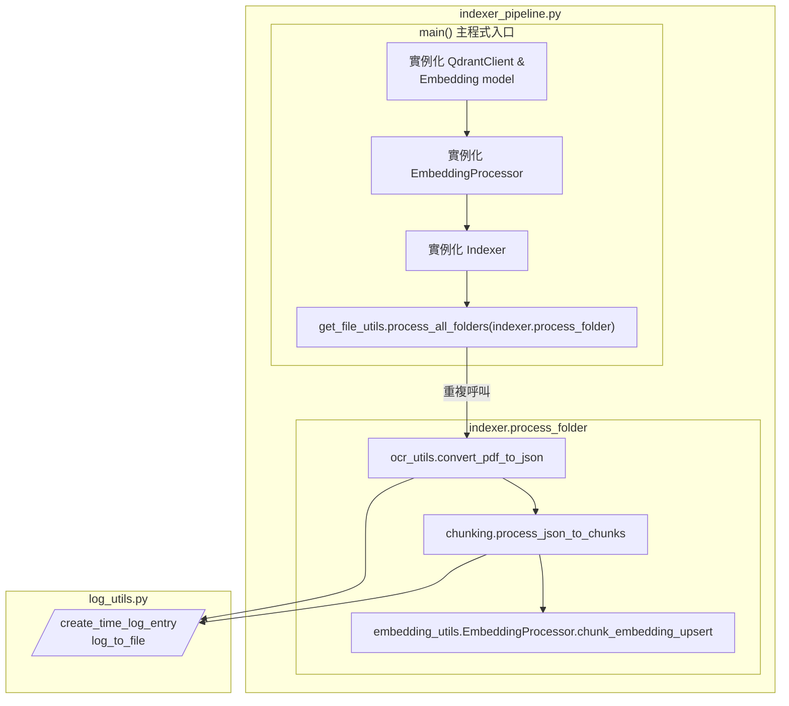
---

#### `__init__(self, embedding_processor, client)`

- 目的：輸入實例化模型跟向量資料庫客戶端

#### `process_folder(self, folder_name: str) -> Optional[Dict[str, int]]`

- 目的：處理單一資料夾中的所有 PDF 檔案
- 主要邏輯：
    - 獲取各檔案路徑，過濾已處理檔案
    - 單一檔案會逐一進行：OCR -> Chunking -> Embedding -> Upsert
    - 統計最終結果，各步驟成功＆失敗數量統計

#### `main()`

- 目的：連接 Qdrant、載入模型，處理 PDF 基礎目錄底下所有資料夾（調用`process_all_folders()`）

---

## summary

```
├── summary/
│   ├── summary.py
│   └── summary_pipeline.py
```

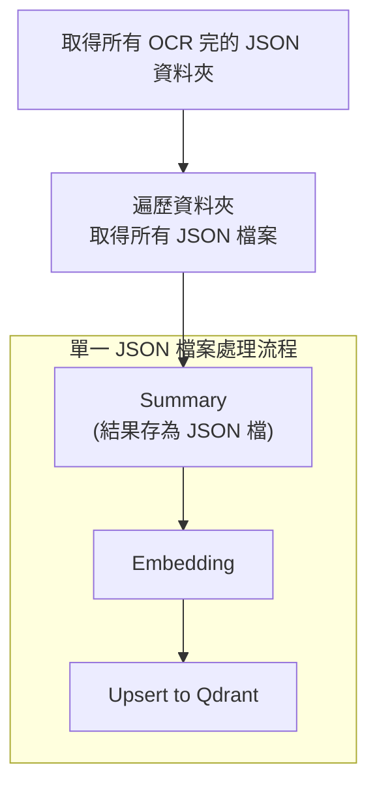

---

### `summary.py`

> 將 OCR 後的原始 JSON 檔案內容進行摘要，再存為 summary JSON 檔

- `summarize_text()`
- `summarize_document_from_json()`

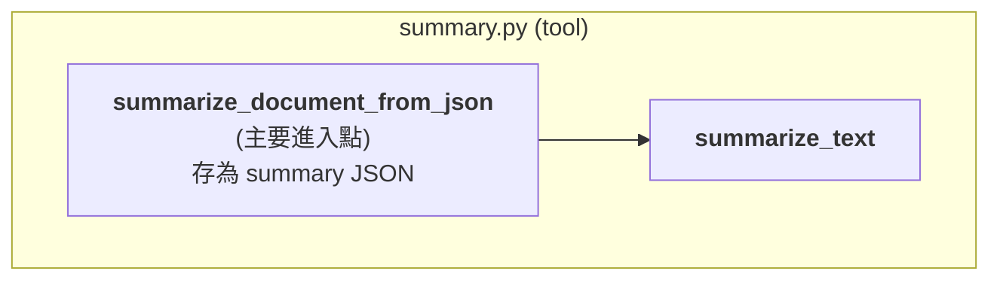

---

#### `summarize_text(text: str) -> Optional[Dict[str, Any]]`

- 目的：呼叫模型產生文章摘要
- 主要邏輯：
    - prompt 設定
    - 定義模型回傳格式
        ```
        {
            "title": "文件標題",
            "file_type": "檔案類型",
            "metadata": [文檔主要元素列表],
            "intent": [相關意圖列表],
            "summary": "內容摘要"
        }
        ```
    - 模型請求設定
    - 呼叫模型

#### `summarize_document_from_json(input_json_path: str, output_json_path: str) -> Optional[Dict[str, Any]]`

- 目的：將 JSON 檔內容取摘要，另存新的 summary JSON 檔
- 主要邏輯：
    - 讀取輸入的 JSON 檔案
    - 合併每一頁的內容
    - 呼叫模型進行摘要（調用`summarize_text()`）
    - 存成 JSON 檔
        ```
        {
          "title": "聲明書",
          "file_type": "申請書表單",
          "metadata": [
            "文字",
            "表格",
            "表單欄位",
            "簽名欄位",
            "勾選項目"
          ],
          "intent": [
            "理賠規範",
            "申請書表單聲明書"
          ],
          "summary": "此為南山人壽保險股份有限公司團體險被保險人身故後，受益人申請理賠所需填寫的聲明書。...",
          "filename": "團險全體受益人聲明書暨受益系統表-1120101.pdf"
        }
        ```

---

### `summary_pipeline.py`

>  處理 Summary 整體流程

- `Summary` 流程類別
    - `__init__()`
    - `process_folder()`
- 主程式入口`main()` 

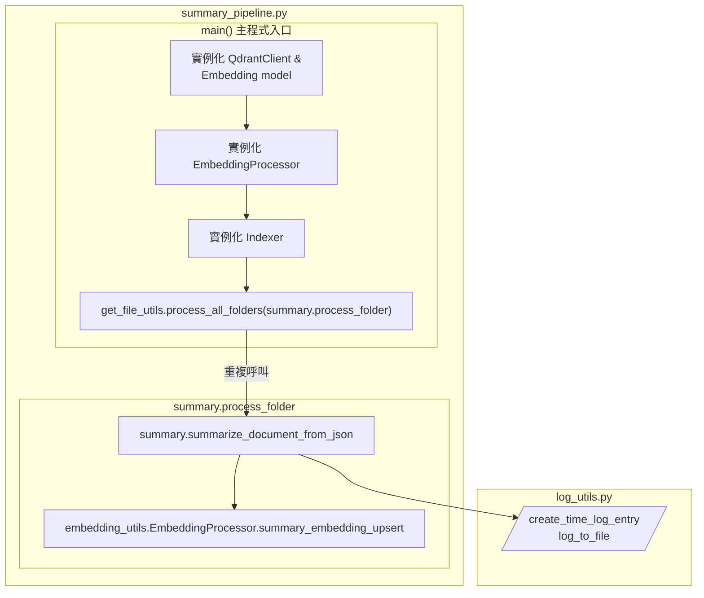

---


#### `__init__(self, embedding_processor, client)`

- 目的：輸入實例化模型跟向量資料庫客戶端

#### `process_folder(self, folder_name: str) -> Optional[Dict[str, int]]`

- 目的：處理 OCR 後 JSON 資料夾中的所有 JSON 檔案
- 主要邏輯：
    - 獲取各檔案路徑，過濾已處理檔案
    - 單一檔案會逐一進行：Summary -> Embedding -> Upsert
    - 統計最終結果，各步驟成功＆失敗數量統計

#### `main()`

- 目的：連接 Qdrant、載入模型，處理 PDF 基礎目錄底下所有資料夾（調用`process_all_folders()`）


---

## retriever

```
├── retriever/
│   ├── requirements.txt
│   ├── search.py
│   ├── rerank.py
│   ├── retrieve_pipeline.py
│   └── api.py
```

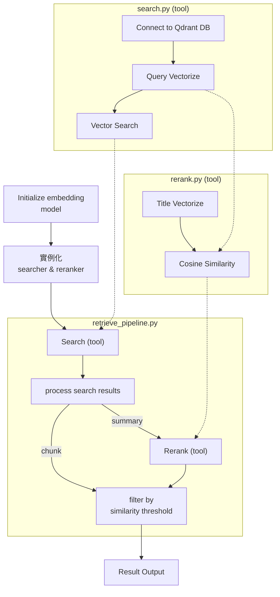
---


### `search.py`

> - 將使用者查詢向量化
> - 執行 Qdrant 向量搜索

- 向量搜尋類別 `class VectorSearch`
    - `__init__()`
    - `embed_query()`
    - `_build_category_filter()`
    - 主要搜尋方法：`search()`

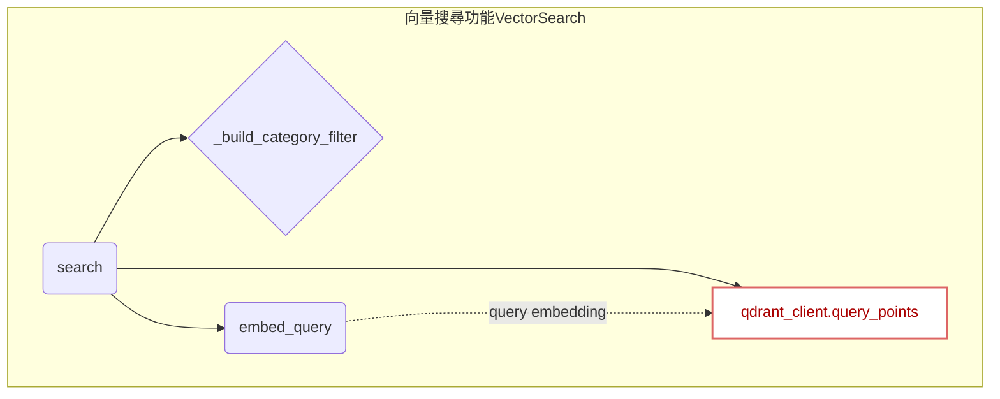

---

#### `__init__(self, embedding_model: Any)`

- 目的：定義 Embedding 模型、向量資料庫連線


#### `embed_query(self, text: str) -> List[float]`

- 目的：將文字轉換為向量

#### `_build_category_filter(self, categories: List[str] = None) -> Filter`

- 目的：建立 metadata 類別過濾條件
- 主要邏輯：
    - 接收 categories 列表作為過濾依據
    - 遍歷 config.PDF_METADATA，找出對應 category 的 PDF 名稱
    - 如果找到符合的 PDF 則建立 Qdrant Filter
#### `search(self, query: str, top_k: int, search_type: str, collection: str, categories: List[str] = None) -> Tuple[List[float], List[Any]]`

- 目的：執行向量相似度搜尋
- 主要邏輯：
    - if any, 建立過濾條件
    - 查詢向量化
    - 執行 Qdrant 搜尋
    - 返回 query embedding ＆ 搜尋結果


---

### `rerank.py`

> - 將使用者查詢與文件標題計算 cosine similarity 進行重排序

- 向量搜尋類別 `class Rerank`
    - `__init__()`
    - `_cosine_similarity()`
    - 主要重排序方法：`rerank_by_title()`

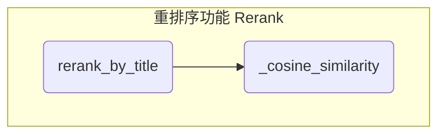
---

#### `__init__(self, embedding_model: Any)`

- 目的：定義 Embedding 模型

#### `_cosine_similarity(self, vec1: List[float], vec2: List[float]) -> float`

- 目的：計算兩個向量的 cosine similarity

#### `rerank_by_title(self, query_vector: List[float], results: List[Dict[str, Any]]) -> List[Dict[str, Any]]`

- 目的：根據文件標題（title）與查詢（query）相關性進行重排序
- 主要邏輯：
    - 接收前一步搜尋結果
    - 將文件標題（title）向量化
    - 計算文件標題（title）與查詢（query）的 cosine similarity
    - 重排序後輸出結果

---

### `retrieve_pipeline.py`

> - 整合檢索流程
> - 依據搜尋類型決定是否要重排序
> - 相關性分數閾值篩選

- 檢索器類別
    - `__init__()`
    - `_process_search_results()`
    - 主要檢索流程：`retrieve()`

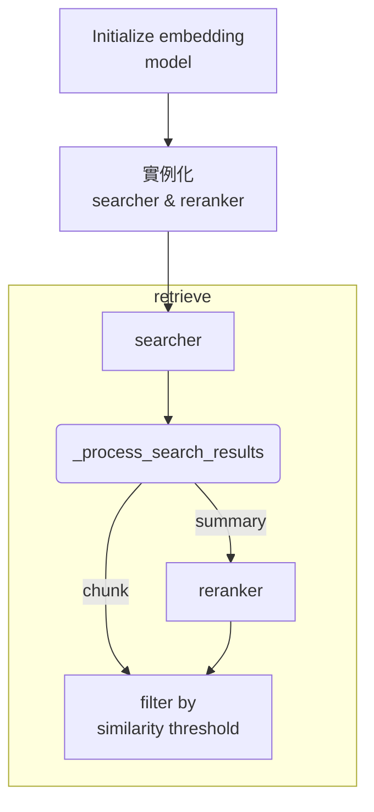
---


#### `__init__(self, search_tool: Any, rerank_tool: Any) -> None`
- 目的：初始化檢索器，注入依賴的工具實例
    - searcher
    - reranker

#### `_process_search_results(self, search_type: str, search_result: List[Any]) -> List[Dict[str, Any]]`
- 目的：處理搜尋結果，分成 chunk 與 summary 兩種格式
- 主要邏輯：接收 search_result，並依據不同查詢類型的資料 payload 整理成對應的結果形式
    - chunk
        ```
        result = {
            'similarity_score': point.score,
            'filename': point.payload.get('filename', ''),
            'page': point.payload.get('page', ''),
            'content_preview': point.payload.get('content', '')[:200] + "..." if len(point.payload.get('content', '')) > 200 else point.payload.get('content', ''),
            'full_content': point.payload.get('content', '')
        }
        ```
    - summary
        ```
        result = {
            'similarity_score': point.score,
            'filename': point.payload.get('filename', ''),
            'title': point.payload.get('title', ''),
            'file_type': point.payload.get('file_type'),
            'metadata': point.payload.get('metadata', []),
            'summary': point.payload.get('summary', '')
        }
        ```


#### `retrieve(self, query: str, threshold_score: float, top_k: int, collection: str, search_type: str, categories: List[str] = None) -> Dict[str, Union[List[Any], int]]`

- 目的：整合檢索流程
- 主要邏輯：
    - 執行向量搜尋（searcher）
    - 處理搜尋結果格式（`_process_search_results()`）
    - 根據搜尋類型進行後續處理
        - chunk：直接進行相關性分數閾值過濾
        - summary：進行重排序（reranker）在做閾值過濾
    - 回傳形式：
        ```
        # final output format
        result_dict = {
            "results": results, 
            "total_count": len(results)
        }
        ```


---

### `api.py`

> 基於 FastAPI 的 RAG 檢索服務，接收前端查詢請求，調用檢索器並返回結果。

- `lifespan()`
- `class QueryRequest(BaseModel)`
- `retrieve()`

#### `lifespan(app: FastAPI)`

- 目的：非同步資源生命週期管理，確保核心資源在服務啟動時被高效地初始化，並在服務關閉時安全釋放。
- 主要邏輯：
    - 載入 Embedding Model
    - 實例化 Searcher & Reranker
    - 初始化 RAG 檢索器


#### `retrieve(req: QueryRequest, request: Request) -> Dict[str, Union[List[Any], int]]`

- 目的：使用檢索器處理搜尋請求並返回結果
- 主要邏輯：
    - 路由定義
    - 獲取檢索器實例
    - 服務狀態檢查
    - 執行檢索邏輯
- 介面規格：
    `POST /retrieve`
    ```
    json = {
        query: str  # 查詢內容
        top_k: int = config.TOP_K  # 返回結果數量
        threshold_score: float = config.THRESHOLD_SCORE  # 相似度閾值
        collection: Optional[str]   # 查詢 intent，用來指定 collection 名稱
        search_type: str  # 查詢類型：chunk 或 summary
    }
    ```
- 回傳狀態：
    - 200 OK：檢索成功 -> 成功返回包含搜尋結果和計數的字典
    - 503 Service Unavailable：服務未啟動 -> retriever 尚未初始化完成，服務不可用。
    - 500 Internal Server Error：內部錯誤 -> 檢索服務在執行 retrieve 過程中發生未預期的異常。
- 暴露 API 端口：
    ```
    uvicorn api:app --host 0.0.0.0 --port 8000
    ```
    `api:app` → api 是檔名（不含 .py），app 是 FastAPI 實例名稱。
- 使用範例：
    ```
    url = "http://0.0.0.0:8000/retrieve"
    payload = {
        "query": "癌症保險 疾病等待期間",
        "top_k": 20,
        "threshold_score": 0.4,
        "search_type": search_type,
        "collection": "form"
    }

    response = requests.post(url, json=payload)
    ```

## agent

```
├── agent/
│   ├── requirements.txt
│   ├── search_tools.py
│   ├── mrkl.py  
│   ├── agent_pipeline.py 
│   └── api.py
```

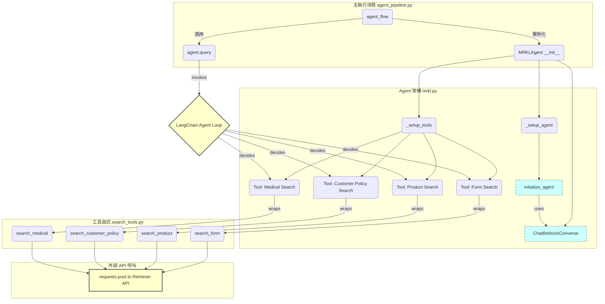

---

### `search_tools.py`

> 建立 agent 會用到的搜索工具，分為四個資料集的對應工具

- `search_form()`：搜索「其他各項表單」（chunk_other）
- `search_product()`：搜索「商品總覽」（chunk_product-overview）
- `search_customer_policy()`：搜索「客戶服務保單服務」（chunk_costomer-policy-service）
- `search_medical()`：搜索「投保與醫務」（chunk_application-and-medical）

---

#### `search_form(query: str) -> str` 和其他三個 collection 搜尋函式

- 目的：搜索指定 Qdrant collection
- 主要邏輯：
    - 呼叫 Retriever API
    - 整理回傳結果
        ```
        formatted = (
            f"📄 文件 {i}\n"
            f"   來源: {result.get('filename', '未知')} (第{result.get('page', 'N/A')}頁)\n"
            f"   相似度: {result.get('similarity_score', 0):.3f}\n"
            f"   完整內容: {result.get('full_content', '').strip()}\n"
            "------------------------------------------------------------"
        )
        ```


---

### `mrkl.py`

> 建構 agent 模型及其思考框架

`class MRKLAgent` MRKL框架 agent 類別
- `__init__()`
- `_setup_tools()`
- `_setup_agent()`
- `query()`

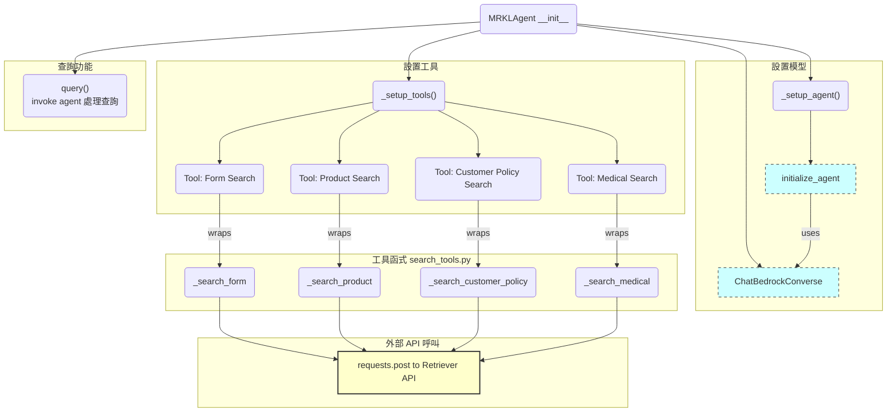

---

#### `__init__(self)`

- 目的：初始化 MRKL Agent，使用 Amazon Bedrock LLM

#### `_setup_tools(self) -> None`

- 目的：將四個搜尋的函式設定為 Agent 的工具

#### `_setup_agent(self) -> None`

- 目的：設置 Agent
- 主要邏輯：`initialize_agent()`
    - 設定工具
    - 設定 LLM
    - 設定 Agent type
    - 設定 Agent 參數
    - 設定最大迭代次數
    - 設定最大執行時間
    - 設定與「中間輸出步」相關的參數

#### `query(self, question: str) -> Tuple[List[Dict[str, str]], str]`

- 目的：處理查詢，返回中間步驟和最終答案
- 主要邏輯：
    - 呼叫 Agent 執行思考
        - Think: 問題進來要調用哪個工具（查哪個collection）
        - Action: using tools
            - `search_product_tool`：搜尋 `chunk_product-overview` collection
            - `search_policy_tool`：搜尋 `chunk_customer-policy-service` collection
            - `search_medical_tool`：搜尋 `chunk_application-and-medical` collection
            - `search_form_tool`：搜尋 `chunk_other` collection
        - Observation: 觀察搜尋結果，決定還需要再使用什麼工具 
    - 處理中間步驟為字典 `step`，存為列表 `inter_steps`
        ```
        step = {
            "thought": agent_action.log.split("\n")[0],
            "action": agent_action.tool,
            "action_input": agent_action.tool_input,
            "observation": str(observation)
        }
        ```
        ```
        inter_steps = [
            {
                "thought": "我需要使用 search_form_tool 來查詢天氣。",
                "action": "search_form_tool",
                "action_input": {"location": "台北"},
                "observation": "氣象局資料顯示今天多雲，溫度介於 22 到 28 度。"
            },
            {
                "thought": "我已取得資料，現在可以回答使用者。",
                "action": "Final Answer",
                "action_input": None,
                "observation": None
            },
            {
                "final_answer": "今天台北多雲，氣溫約 22～28 度。"
            }
        ]
        ```
---

### `agent_pipeline.py`

> 整合 agent 搜尋、回答流程

- `agent_flow()`

---

#### `agent_flow(query: str) -> Dict[str, Any]`

- 目的：執行 MRKL Agent，儲存整個查詢過程和最終結果
- 主要邏輯：
    - 將所有過程儲存為列表 `steps`
    - 實例化 Agent ，調用查詢功能，將返回的中間步存入 `steps`
        ```
        steps = [
            {"start": "開始 Agent 執行..."},
            {
                "thought": "...",
                "action": "...",
                "action_input": "...",
                "observation": "..."
            },
            {
                "thought": "...",
                "action": "...",
                "action_input": "...",
                "observation": "..."
            },
            ...
            {"final_answer": "..."},
            {"end": "Agent 執行完成"}
        ]
        ```
    - 返回最後結果
        ```
        result_dict = {
            "query": query,
            "steps": steps,
            "final_result": final_answer
        }
        ```

---


### `api.py`

> 基於 FastAPI 的 RAG 檢索服務，接收前端查詢請求，調用 agent 並返回結果。

- `class QueryRequest(BaseModel)`
- `ask_agent()`

#### `ask_agent(req: QueryRequest) -> Dict[str, Any]`

- 目的：呼叫 agent 處理搜尋請求並返回結果
- 主要邏輯：
    - 路由定義
    - 呼叫 agent 進行查詢（調用`agent_pipeline.agent_flow`）
- 介面規格：
    `POST /agent`
    ```
    json = {
        query: str  # 查詢內容
    }
    ```
- 暴露 API 端口：
    ```
    uvicorn api:app --host 0.0.0.0 --port 8001
    ```
- 使用範例：
    ```
    url = "http://0.0.0.0:8001/agent"
    payload = {
        "query": "癌症保險 疾病等待期間"
    }

    response = requests.post(url, json=payload)
    ```

---

## frontend

```
│   # streamlit UI介面
├── frontend/
│   ├── config.py
│   ├── requirements.txt
│   ├── kw_mapping.json
│   ├── intent.py
│   └── app.py 
```

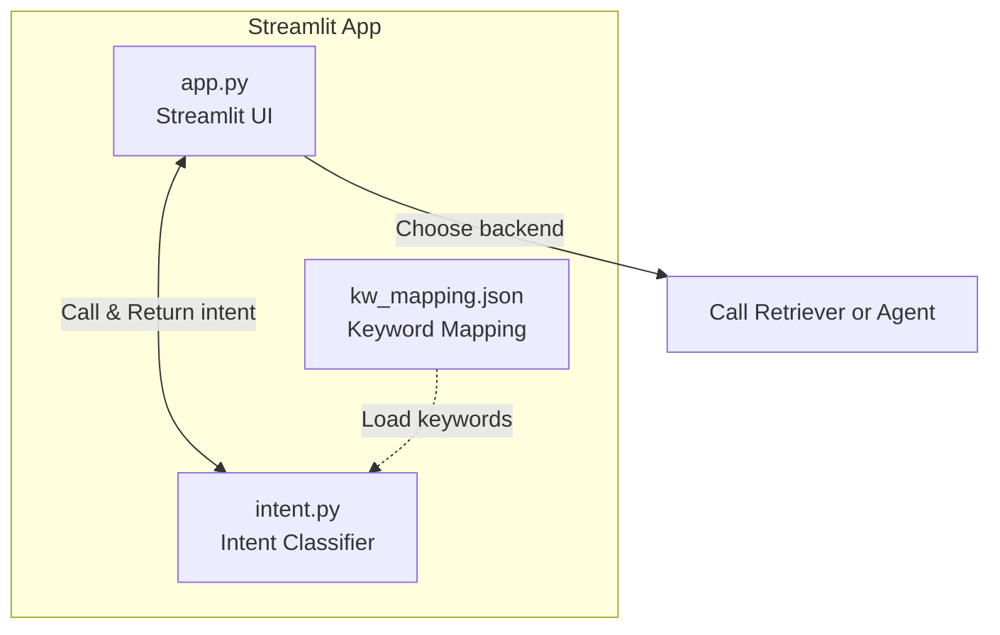

---

### `kw_mapping.json`

- 意圖編號與其實際意圖
    - intent 1: 查詢商品與行銷資訊
    - intent 2: 查詢投保/核保/醫務相關文件
    - intent 3: 查詢理賠服務相關規範
    - intent 4: 查詢契約與保單變更
    - intent 5: 查詢繳費與收費管理相關文件
    - intent 6: 查詢增員/組織發展/輔導相關文件
    - intent 7: 下載申請書/表單/聲明書
    - intent 8: 查詢制度/規範/獎勵辦法
    - intent 9: 查詢E化相關文件或操作手冊
    - intent 10: 查詢公司資訊/新聞/刊物
- 每個關鍵字可能會對應到一個以上的意圖，後面夾帶不同的相關詞
    ```
    {
        "keyword":"高齡",
        "intent":1,
        "related_words":"高齡保障、高齡社會專案、高齡醫療意外、非投資型相關"
    },
    {
        "keyword":"高齡",
        "intent":7,
        "related_words":"高齡投保規範，高齡投保評估量表、高齡要保書(樂齡)"
    },
    ```

---

### `intent.py`


> - 讀取 kw_mapping.json
> - 對輸入 query 進行斷詞
> - 根據關鍵字查找對應的意圖和相關詞


#### jieba 斷詞

- 主要邏輯：抽取關鍵字與搜尋意圖配對總表 `kw_mapping.json` 裡的關鍵字進行去重，建立 jieba 斷詞的自定義字典
    

#### `expand_query(query: str) -> Tuple[bool, list]`
- 目的：匹配 query 中是否有對應到關鍵字意圖
- 主要邏輯：
    - 先對 query 進行 jieba 斷詞
    - 匹配斷詞結果的列表中是否有匹配到關鍵字
    - 使用 `config.INTENT_COLLECTION_MAP` 配對搜尋意圖與相關詞
        ```
        INTENT_COLLECTION_MAP = {
            "1": "product-overview",
            "2": "application-and-medical",
            "3": "customer-policy-service",
            "4": "customer-policy-service",
            "5": "customer-policy-service",
            "6": "customer-policy-service",
            "7": "other",
            "8": "other",
            "9": "other",
            "10": "other"   
        }
        ```
        ```
        results = [
            (intent_collection, expanded_query),
            (intent_collection, expanded_query),
            ...
        ]
        # example
        results = [
            ('product-overview', '保險金 保額 保險金額 基本保額'),
            ('application-and-medical', '保險金 理賠金 保險給付 給付金 保險金扣抵醫療費 保險金扣抵醫療費授權書 保險金扣抵醫療費服務流程 保險金扣抵醫療費相關問題')
        ]        
        ```


---

### `app.py`


> - 建立使用者介面讓使用者能夠輸入查詢問題
> - 分為 Agent 或 Document Search 進行查詢，最後顯示結果並收集使用者回饋

- 查詢功能
    - `run_agent()`
    - `run_document_search()`
- 結果展示
    - `display_agent_results()`
    - `display_document_results()`
- 回饋處理
    - `save_feedback()`
- App 頁面設定
    - Tab 1：智能問答
    - Tab 2：評價統計


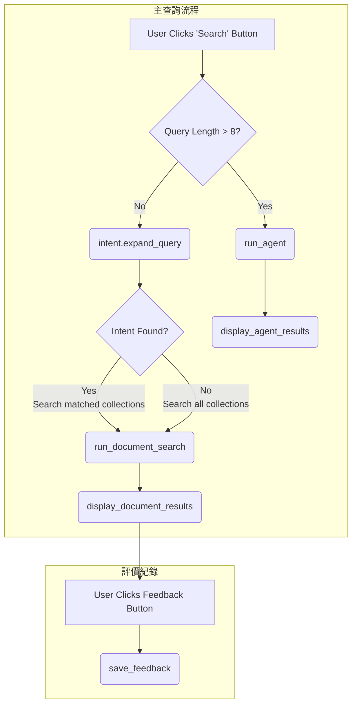


---

#### `run_agent(query: str) -> Tuple[list, str]`

- 目的：呼叫 Agent API，返回 steps 與最終答案


#### `run_document_search(intent_classify: tuple) -> Tuple[List[Dict], int]`

- 目的：呼叫 Retriever API，返回 final_results 與 total_counts
- 主要邏輯：
    - intent_classify 裡可能有多個`(intent, expand query)`，會依據意圖迭代，到指定的 collection 進行搜尋
    - 將所有檢索回來的文件都存在 final_results 列表

#### `display_agent_results(agent_steps: list) -> None`

- 目的：接收 Agent API 回傳結果，整理成在 Streamlit 呈現的形式
- 主要邏輯：
    - Thouhgt
    - Action
    - Action Input
    - Observation
        - retrieved documents
    - Final Answer 

#### `display_document_results(query: str, results: dict, total_count: int, similarity_threshold: int) -> None`

- 目的：接收 Retriever API 回傳結果，整理成在 Streamlit 呈現的形式
- 主要邏輯：
    - 對所有文件的相關性分數做排序
    - 頁面呈現
        - file name
        - similarity score
        - title
        - summary
    - 提供回饋按鈕：有幫助/沒幫助

#### `save_feedback(query: str, pdf_name: str, rating: str) -> None`

- 目的：儲存使用者回饋到 JSON 檔案
- 主要邏輯：
    - 在使用者按下回饋按鈕時觸發回饋儲存機制
    - 儲存資料為：時間戳記、使用者查詢問題、使用者回饋之文件、使用者評價（有幫助/沒幫助）
        ```
        feedback_data = {
            "timestamp": datetime.datetime.now().isoformat(),
            "query": query,
            "pdf_name": pdf_name,
            "rating": rating
        }  
        ```
    - 讀取舊有檔案內容並刪除舊檔案
    - 將舊資料與新增資料合併，並建立新檔案 

